# 世界の中小農家件数統計レポート

## 概要

本レポートは、世界各国の中小農家（Smallholder Farms）の件数を比較し、上位10カ国を抽出したものです。
中小農家は一般的に2ヘクタール未満の農地を持つ農業経営体と定義されています。

**調査日**: 2025年10月19日  
**データソース**: FAO統計、各国農業センサス、農業統計データベース

---

## 上位10カ国ランキング

### 国別中小農家件数

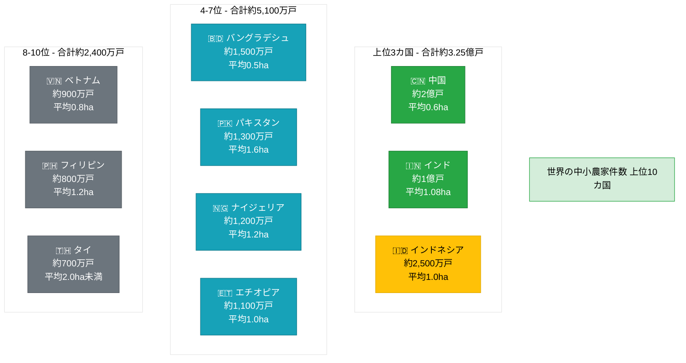

### 詳細データテーブル

| 順位 | 国名 | 農家数 | 平均耕地面積 | 地域 | 主要特徴 |
|:----:|:-----|-------:|:------------:|:----:|:---------|
| 1 | 🇨🇳 中国 | 約2億戸 | 0.6ha | アジア | 世界最大の農家数。極小規模農家が大半 |
| 2 | 🇮🇳 インド | 約1億戸 | 1.08ha | アジア | 農業が主要産業。2ha未満が多数 |
| 3 | 🇮🇩 インドネシア | 約2,500万戸 | 1.0ha | アジア | 島嶼国家で小規模農家が広く分布 |
| 4 | 🇧🇩 バングラデシュ | 約1,500万戸 | 0.5ha | アジア | 人口密度が高く、極小規模農家が主流 |
| 5 | 🇵🇰 パキスタン | 約1,300万戸 | 1.6ha | アジア | 農業が経済の中心。小規模農家が一般的 |
| 6 | 🇳🇬 ナイジェリア | 約1,200万戸 | 1.2ha | アフリカ | アフリカ最大の農業国。小規模農家が主流 |
| 7 | 🇪🇹 エチオピア | 約1,100万戸 | 1.0ha | アフリカ | 農業従事者が多く、小規模農家が大部分 |
| 8 | 🇻🇳 ベトナム | 約900万戸 | 0.8ha | アジア | 農業が盛んで、1ha未満が多数 |
| 9 | 🇵🇭 フィリピン | 約800万戸 | 1.2ha | アジア | 多くの農村地域で小規模農家が活動 |
| 10 | 🇹🇭 タイ | 約700万戸 | <2.0ha | アジア | 農業が重要産業。小規模農家が多数 |

**合計**: 上位10カ国で約**4億戸**（世界の小規模農家の約80%を占める）

---

## 視覚化グラフ

### 農家数の比較（棒グラフ）


### 平均耕地面積の比較

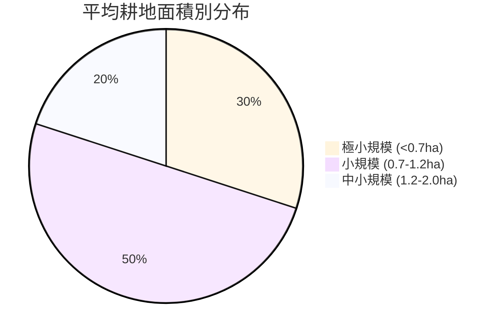

**極小規模農家が多い国**: 中国(0.6ha)、バングラデシュ(0.5ha)、ベトナム(0.8ha)

---

## 地域別分析

### 地域別農家数分布

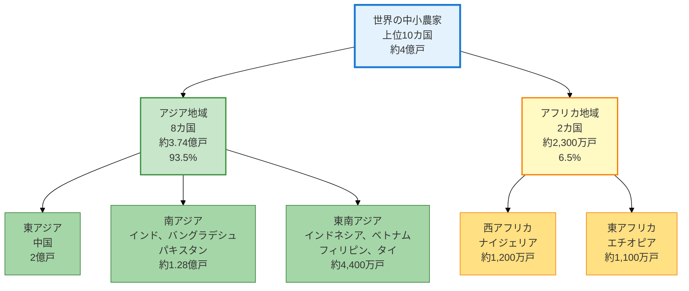

### 地域別統計

| 地域 | 国数 | 総農家数 | 割合 | 特徴 |
|:-----|:----:|:--------:|:----:|:-----|
| **アジア** | 8 | 約3.74億戸 | 93.5% | 世界の中小農家の大部分を占める |
| - 東アジア | 1 | 約2.00億戸 | 50.0% | 中国が圧倒的 |
| - 南アジア | 3 | 約1.28億戸 | 32.0% | インド、バングラデシュ、パキスタン |
| - 東南アジア | 4 | 約0.44億戸 | 11.0% | 島嶼国家と大陸部の混在 |
| **アフリカ** | 2 | 約0.23億戸 | 6.5% | ナイジェリア、エチオピア |

---

## 主要な傾向と分析

### 1. 地域集中度

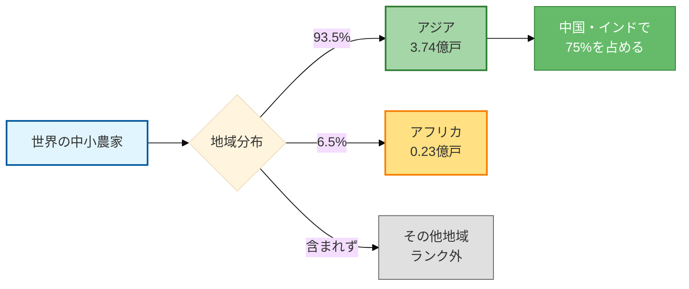

**主要ポイント**:
- アジアに圧倒的に集中（上位10カ国中8カ国）
- 中国とインドだけで約3億戸（上位10カ国の75%）
- アフリカからはナイジェリアとエチオピアのみランクイン

### 2. 農地規模の特徴

**平均耕地面積の分類**:

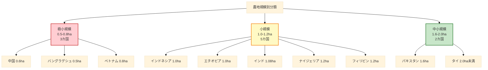

- **極小規模（<0.8ha）**: 中国、バングラデシュ、ベトナム
- **小規模（1.0-1.2ha）**: インド、インドネシア、エチオピア、ナイジェリア、フィリピン
- **中小規模（1.6-2.0ha）**: パキスタン、タイ

### 3. 人口密度との相関

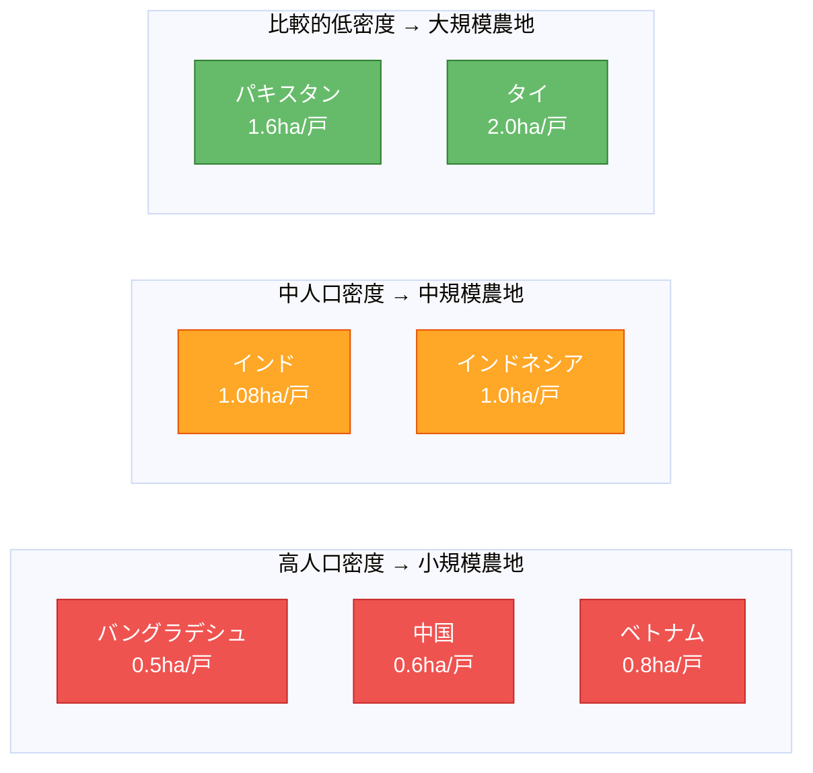

**相関分析**:
- 人口密度が高い国ほど農地面積が小さい傾向
- バングラデシュは最も小規模（0.5ha）で人口密度も最高レベル
- 土地資源の制約が農地規模を決定する主要因

### 4. 時系列トレンド

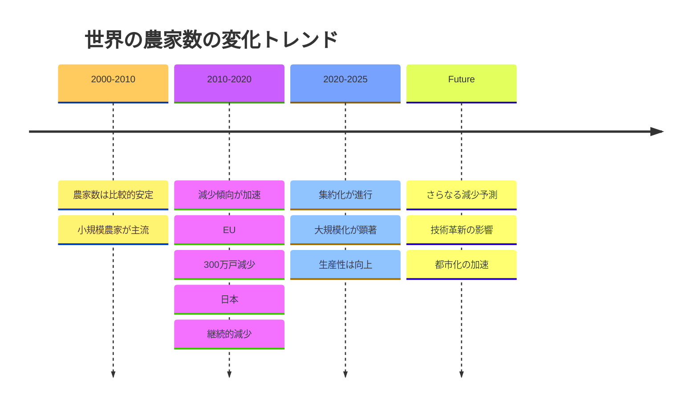

**主要トレンド**:
- 世界的に農家数は減少傾向（特に先進国）
- EU: 2010-2020年で約300万戸減少
- 日本: 継続的な減少（2000年から約30%減）
- 一方、生産額は増加（集約化・効率化の成果）

---

## グローバル統計サマリー

### 全世界の中小農家統計

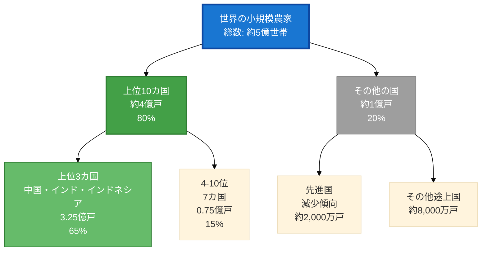

| カテゴリ | 農家数 | 割合 | 備考 |
|:---------|-------:|:----:|:-----|
| **世界総数** | 約5億戸 | 100% | 推定値（2020年代前半） |
| 上位10カ国 | 約4億戸 | 80% | 本レポート対象 |
| - 中国・インド | 約3億戸 | 60% | 2カ国で過半数 |
| - その他8カ国 | 約1億戸 | 20% | インドネシア以下 |
| その他の国 | 約1億戸 | 20% | 100カ国以上に分散 |

---

## 参考データ: 地域別比較

### EU（欧州連合）の状況

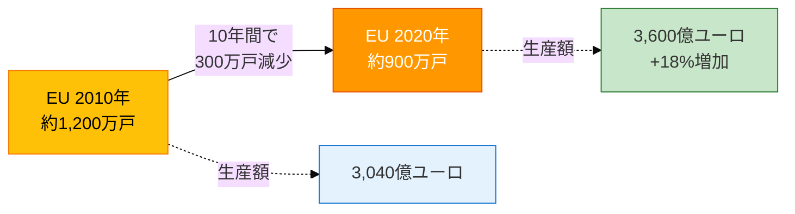

**EU特徴**:
- 農家数は減少（-25%）
- 生産額は増加（+18%）
- 大規模化・集約化が顕著

### 日本の状況

| 年次 | 総農家数 | 販売農家数 | 特徴 |
|:----:|:--------:|:----------:|:-----|
| 2000年 | 約312万戸 | 約240万戸 | - |
| 2010年 | 約253万戸 | 約163万戸 | 19%減少 |
| 2020年 | 約175万戸 | 約103万戸 | 31%減少 |

**日本の特徴**:
- 継続的な減少傾向
- 高齢化による離農
- 法人化・大規模化の推進

---

## データの信頼性と限界

### データソース

1. **FAO (国連食糧農業機関) 統計**: 主要なグローバル農業統計
2. **各国農業センサス**: 中国、インド、インドネシア等の国別データ
3. **世界銀行データベース**: 農業産出額、付加価値額
4. **学術研究**: EU、アジア等の地域別農業構造分析

### 注意事項

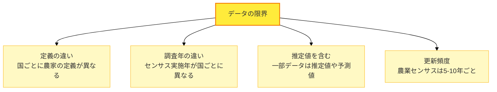

**主な限界**:

1. **定義の違い**: 各国で「農家」や「小規模農家」の定義が異なる
2. **調査時期**: センサス実施年が国ごとに異なる（2015-2020年の範囲）
3. **推定値**: 一部データは推定値や予測値を含む
4. **更新頻度**: 農業センサスは5-10年ごとのため、最新状況と差異がある可能性

### データ品質評価

| 国名 | データ品質 | 最終センサス年 | 備考 |
|:-----|:----------:|:--------------:|:-----|
| 中国 | ⭐⭐⭐⭐ | 2016-2020年 | 大規模センサス実施 |
| インド | ⭐⭐⭐⭐ | 2015-2016年 | 詳細な農業統計あり |
| インドネシア | ⭐⭐⭐ | 2013年 | やや古いデータ |
| その他アジア | ⭐⭐⭐ | 2010-2020年 | 国により差がある |
| アフリカ諸国 | ⭐⭐ | 推定値多い | センサス頻度低い |

---

## 結論

### 主要な発見

1. **アジアの圧倒的優位**: 上位10カ国中8カ国がアジア諸国で、世界の中小農家の93.5%を占める

2. **中国・インドの重要性**: この2カ国だけで約3億戸（世界の60%）を占め、世界の食糧安全保障に極めて重要

3. **極小規模化**: 多くの国で平均耕地面積が1ヘクタール前後と非常に小規模

4. **減少トレンド**: 先進国では農家数が減少し、大規模化・集約化が進行中

5. **地域格差**: アフリカの農業大国（ナイジェリア、エチオピア）も上位にランクインするが、アジアと比較すると規模は小さい

### 今後の展望

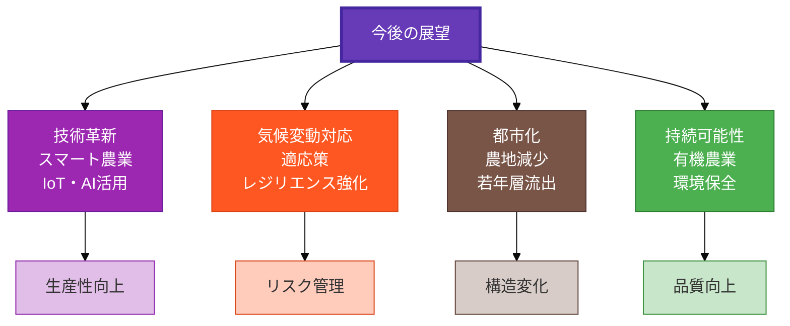

**重要な課題**:
- 小規模農家の収益性向上
- 若年層の農業参入促進
- 気候変動への適応
- 持続可能な農業への転換
- デジタル技術の導入

---

## 補足資料

### 用語定義

- **中小農家（Smallholder Farms）**: 一般的に2ヘクタール未満の農地を経営する農家
- **農業経営体（Agricultural Holdings）**: 農業を営む単位（個人、法人、組合等）
- **販売農家**: 経営耕地面積30a以上または農産物販売金額50万円以上の農家
- **自給的農家**: 経営耕地面積30a未満かつ農産物販売金額50万円未満の農家

### 関連指標

| 指標 | 説明 | 用途 |
|:-----|:-----|:-----|
| 農家数 | 農業経営体の総数 | 規模分析 |
| 平均耕地面積 | 1戸あたりの平均農地面積 | 規模評価 |
| 農業産出額 | 年間の農業生産額 | 経済規模 |
| 農業従事者数 | 農業に従事する人数 | 雇用分析 |
| 農地利用率 | 農地の有効活用度 | 効率性評価 |

---

## 参考文献・データソース

1. FAO (Food and Agriculture Organization) - FAOSTAT Database
2. World Bank - World Development Indicators
3. 各国農業センサス（中国、インド、インドネシア等）
4. EU Agricultural Census 2020
5. 日本農林水産省 - 農業センサス
6. 学術論文: "Farm Structure Changes in the EU" (arXiv, 2024)
7. 統計データベース: StatJa.com

---

**レポート作成日**: 2025年10月19日  
**次回更新予定**: 各国の最新農業センサス公開時  
**お問い合わせ**: AGRR Core Project Team

---

---

# 【補足】趣味としての家庭菜園が盛んな国

## 概要

本セクションでは、職業としての農業ではなく、趣味・レジャーとしての家庭菜園（Home Gardening / Kitchen Garden）が盛んな国をまとめています。

**調査日**: 2025年10月19日  
**データソース**: 各国の農業調査、園芸産業統計、消費者調査

---

## 家庭菜園が盛んな国トップ10

### 国別ランキングと特徴

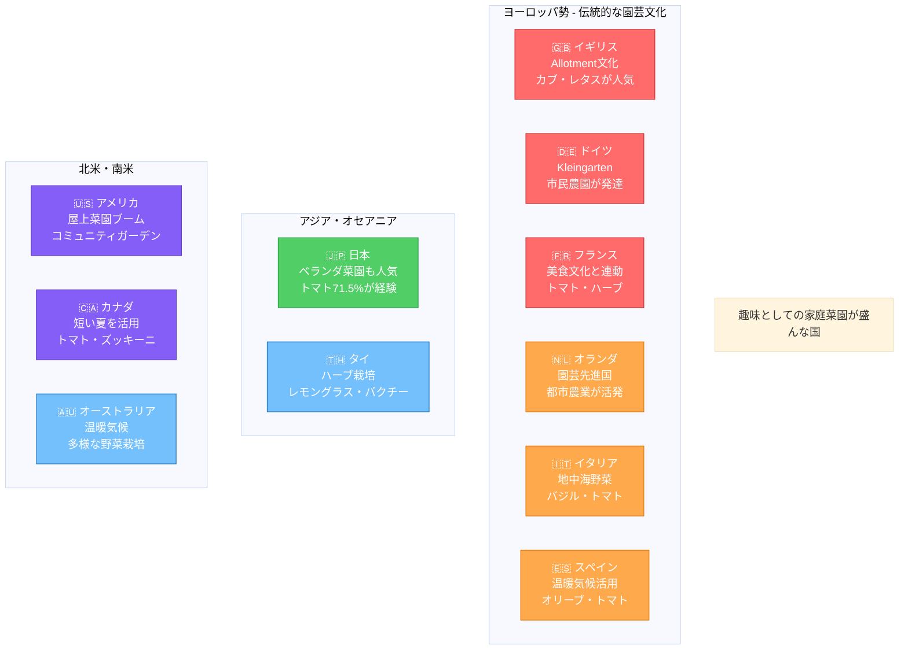

### 詳細リスト

| 順位 | 国名 | 普及度 | 主な栽培作物 | 特徴 | 文化的背景 |
|:----:|:-----|:------:|:-------------|:-----|:-----------|
| 1 | 🇬🇧 イギリス | ⭐⭐⭐⭐⭐ | カブ、レタス、豆類 | Allotment（市民農園）文化が根付く | 19世紀から続く伝統 |
| 2 | 🇩🇪 ドイツ | ⭐⭐⭐⭐⭐ | ジャガイモ、キャベツ、ハーブ | Kleingarten（クラインガルテン）が全国に約100万区画 | 環境意識とオーガニック志向 |
| 3 | 🇯🇵 日本 | ⭐⭐⭐⭐⭐ | トマト、キュウリ、ピーマン | ベランダ菜園も盛ん。トマト栽培経験者71.5% | 都市部でも手軽に楽しむ文化 |
| 4 | 🇺🇸 アメリカ | ⭐⭐⭐⭐ | トウモロコシ、トマト、ブロッコリー | 屋上菜園、コミュニティガーデンが増加 | COVID-19後に急拡大 |
| 5 | 🇫🇷 フランス | ⭐⭐⭐⭐ | トマト、バジル、ズッキーニ | 美食文化と連動した家庭菜園 | 新鮮な食材へのこだわり |
| 6 | 🇦🇺 オーストラリア | ⭐⭐⭐⭐ | トマト、タマネギ、ジャガイモ | 温暖な気候を活かした多様な栽培 | アウトドア文化の一環 |
| 7 | 🇳🇱 オランダ | ⭐⭐⭐ | トマト、レタス、ハーブ | 園芸先進国、都市農業が発達 | スペース有効活用の技術 |
| 8 | 🇮🇹 イタリア | ⭐⭐⭐ | トマト、バジル、ズッキーニ | 地中海性気候に適した野菜 | 伝統的な食文化と直結 |
| 9 | 🇨🇦 カナダ | ⭐⭐⭐ | トマト、ピーマン、ズッキーニ | 短い夏を有効活用 | 地産地消の意識が高い |
| 10 | 🇪🇸 スペイン | ⭐⭐⭐ | トマト、ピーマン、オリーブ | 温暖気候で栽培が容易 | 家庭料理との結びつき |

**特別枠**: 🇹🇭 タイ - レモングラス、パクチーなどハーブ栽培が盛ん

---

## 地域別の家庭菜園文化

### ヨーロッパの家庭菜園文化

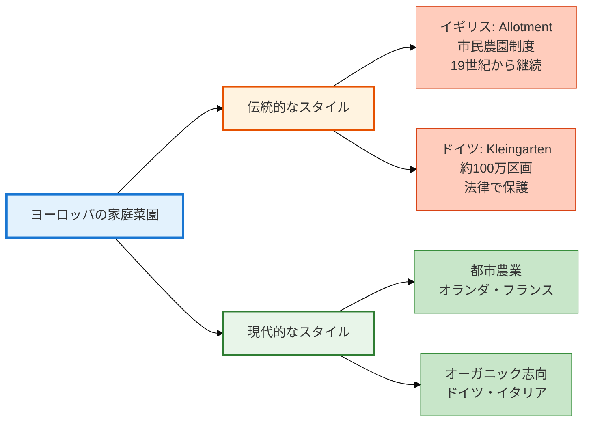

**ヨーロッパの特徴**:

1. **イギリス - Allotment文化**
   - 19世紀から続く市民農園制度
   - 自治体が提供する小区画の農地を借りて栽培
   - 収穫までの期間が短い野菜（カブ、レタス）が人気
   - コミュニティ形成の場としても機能

2. **ドイツ - Kleingarten**
   - 全国に約100万区画の市民農園
   - 法律で保護された制度
   - 環境保護とオーガニック栽培への意識が高い
   - ジャガイモ、キャベツなど伝統的な野菜

3. **フランス - 美食文化との連動**
   - 新鮮な食材へのこだわり
   - トマト、バジル、ズッキーニが人気
   - 家庭料理に直結した栽培

4. **オランダ - 園芸先進国**
   - 限られたスペースの有効活用技術
   - 都市農業が発達
   - 垂直栽培、屋上菜園などの革新的手法

### アジア・オセアニアの家庭菜園

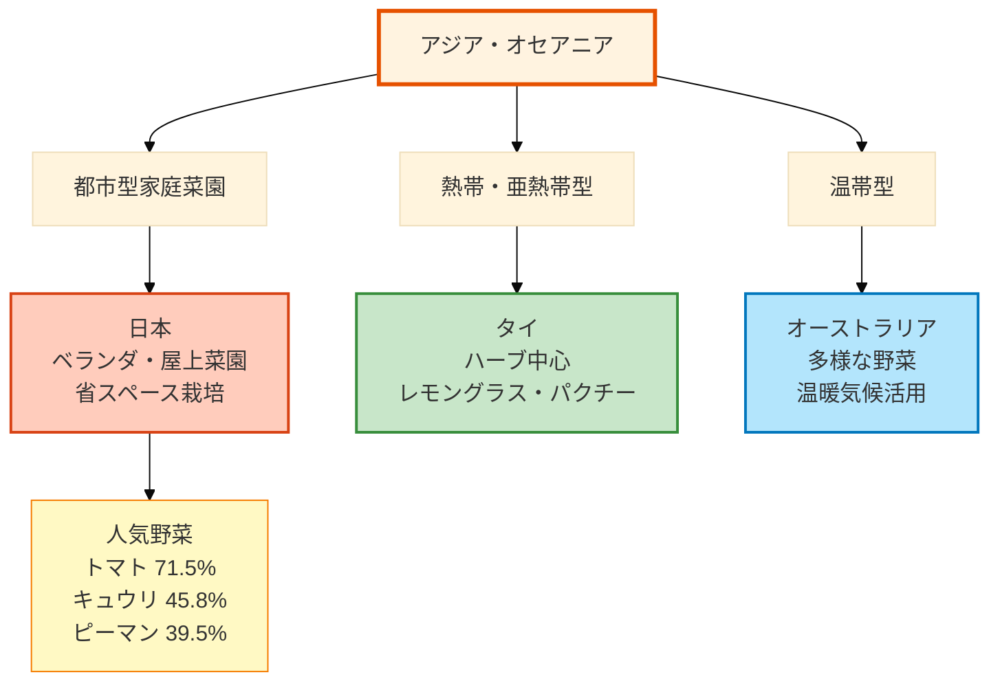

**アジア・オセアニアの特徴**:

1. **日本 - 都市型家庭菜園の発達**
   - ベランダ菜園が都市部で人気
   - プランター栽培が主流
   - **人気野菜トップ3**:
     - トマト: 71.5%
     - キュウリ: 45.8%
     - ピーマン: 39.5%
   - 初心者でも育てやすい品種の開発

2. **タイ - ハーブ栽培が中心**
   - レモングラス、パクチー（コリアンダー）
   - 家庭料理に直結
   - 熱帯気候で年間を通じて栽培可能

3. **オーストラリア - 温暖気候を活かす**
   - トマト、タマネギ、ジャガイモが人気
   - 広い庭を活用した本格的な菜園
   - アウトドアライフスタイルの一部

### 北米の家庭菜園トレンド

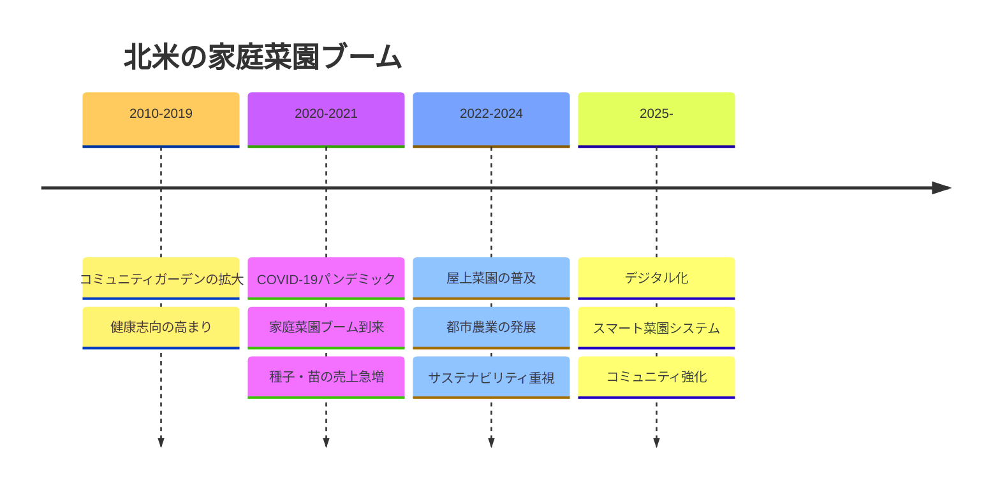

**北米の特徴**:

1. **アメリカ**
   - **屋上菜園（Rooftop Garden）ブーム**: 都市部で限られたスペースを活用
   - **コミュニティガーデン**: 地域住民が共同で管理
   - **COVID-19の影響**: 2020年以降、家庭菜園が急増
   - 人気野菜: トウモロコシ、トマト、ブロッコリー、ホウレンソウ

2. **カナダ**
   - 短い夏（6-8月）を有効活用
   - 地産地消（Local Food）への意識が高い
   - トマト、ピーマン、ズッキーニが主流

---

## 栽培作物の地域別比較

### 人気野菜ランキング

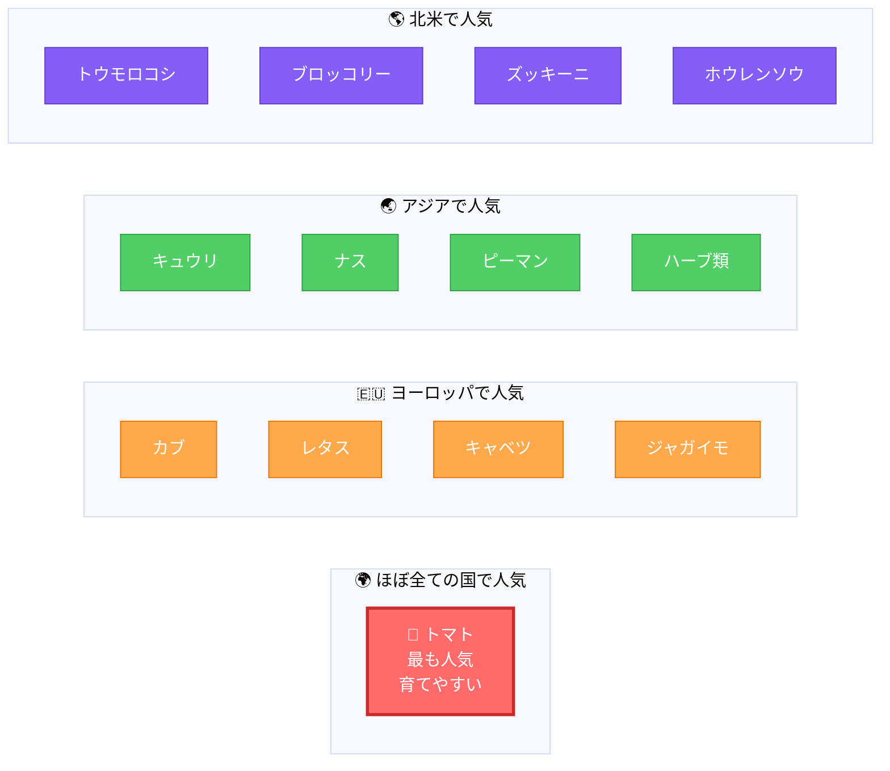

### 地域別人気野菜

| 地域 | 1位 | 2位 | 3位 | 4位 | 5位 |
|:-----|:---:|:---:|:---:|:---:|:---:|
| **日本** | トマト (71.5%) | キュウリ (45.8%) | ピーマン (39.5%) | ナス | 枝豆 |
| **イギリス** | トマト | カブ | レタス | 豆類 | ジャガイモ |
| **ドイツ** | トマト | ジャガイモ | キャベツ | ハーブ | キュウリ |
| **アメリカ** | トマト | トウモロコシ | ブロッコリー | ホウレンソウ | ピーマン |
| **フランス** | トマト | バジル | ズッキーニ | レタス | ハーブ類 |
| **イタリア** | トマト | バジル | ズッキーニ | ナス | ピーマン |
| **オーストラリア** | トマト | タマネギ | ジャガイモ | レタス | ハーブ |
| **タイ** | レモングラス | パクチー | トウガラシ | バジル | ショウガ |

**グローバル共通**: 🍅 **トマト**はほぼ全ての国で最も人気の家庭菜園作物

---

## 家庭菜園の形態別分類

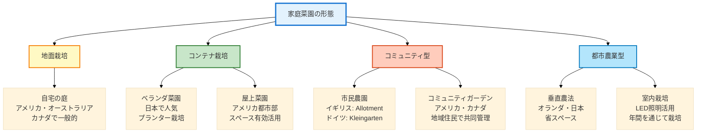

### 形態別の特徴

| 形態 | 主な国 | 利点 | 欠点 | 適した作物 |
|:-----|:-------|:-----|:-----|:-----------|
| **自宅の庭** | 米・豪・加 | 広いスペース、自由度高い | 庭がない家庭は不可 | トウモロコシ、ジャガイモ |
| **ベランダ菜園** | 日本・都市部 | 手軽、管理が楽 | スペース限定 | トマト、ハーブ、葉物 |
| **屋上菜園** | 米・欧の都市 | デッドスペース活用 | 設備投資が必要 | 多様な野菜可能 |
| **市民農園** | 独・英 | 本格的栽培可能 | 移動が必要、順番待ち | ジャガイモ、キャベツ |
| **コミュニティガーデン** | 米・加 | 地域交流、知識共有 | スケジュール調整必要 | 多様な野菜 |
| **垂直農法** | 蘭・日 | 省スペース、効率的 | 技術・設備が必要 | レタス、ハーブ |

---

## COVID-19パンデミックの影響

### 家庭菜園ブームの加速

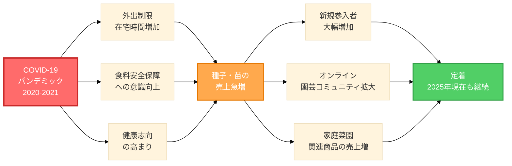

**パンデミックの影響**:

1. **2020年春 - 爆発的ブーム**
   - 種子・苗の売上が前年比200-300%増
   - 園芸用品メーカーの在庫不足
   - 初心者向け教材の需要急増

2. **在宅時間の増加**
   - リモートワークの普及
   - 趣味としての家庭菜園に時間を充てられる
   - 家族での活動として人気

3. **食料安全保障への意識**
   - スーパーマーケットの品不足経験
   - 自給自足への関心
   - 地産地消の重要性再認識

4. **ブームの定着（2025年現在）**
   - 一時的なブームで終わらず継続
   - オンラインコミュニティの活性化
   - デジタルツールの活用（栽培アプリ等）

---

## 家庭菜園文化の背景要因

### 各国の家庭菜園文化を支える要因

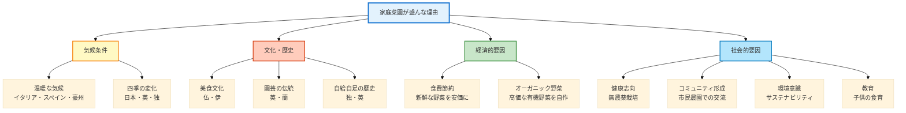

### 要因分析

| 要因カテゴリ | 具体的要因 | 該当国 | 影響度 |
|:-------------|:-----------|:-------|:------:|
| **気候** | 温暖で栽培しやすい | イタリア、スペイン、オーストラリア | ⭐⭐⭐⭐ |
| **気候** | 四季の変化で多様な栽培 | 日本、イギリス、ドイツ | ⭐⭐⭐ |
| **文化** | 美食文化との連動 | フランス、イタリア | ⭐⭐⭐⭐⭐ |
| **文化** | 園芸の伝統 | イギリス、オランダ | ⭐⭐⭐⭐⭐ |
| **文化** | 自給自足の歴史 | ドイツ（Kleingarten） | ⭐⭐⭐⭐ |
| **経済** | 食費節約 | 全般 | ⭐⭐⭐ |
| **経済** | オーガニック志向 | ドイツ、オランダ | ⭐⭐⭐⭐ |
| **社会** | 健康志向 | 全般（特に先進国） | ⭐⭐⭐⭐⭐ |
| **社会** | コミュニティ形成 | イギリス、アメリカ | ⭐⭐⭐⭐ |
| **社会** | 環境・サステナビリティ | ドイツ、オランダ、北欧 | ⭐⭐⭐⭐⭐ |
| **社会** | 子供の食育 | 日本、アメリカ | ⭐⭐⭐ |

---

## 今後のトレンド予測

### 2025年以降の家庭菜園トレンド

```mermaid
%%{init: {'theme':'base'}}%%
graph TB
    Future[未来の家庭菜園] --> Tech[技術革新]
    Future --> Sustain[サステナビリティ]
    Future --> Community[コミュニティ強化]
    
    Tech --> T1[スマート菜園<br/>IoTセンサー<br/>自動水やり]
    Tech --> T2[栽培アプリ<br/>AIによる診断<br/>最適化提案]
    Tech --> T3[LED照明<br/>室内栽培<br/>年間栽培]
    
    Sustain --> Su1[循環型農業<br/>コンポスト<br/>生ゴミ活用]
    Sustain --> Su2[在来種保存<br/>エアルーム品種<br/>生物多様性]
    Sustain --> Su3[水資源管理<br/>雨水利用<br/>点滴灌漑]
    
    Community --> C1[オンライン<br/>SNSコミュニティ<br/>知識共有]
    Community --> C2[種子交換会<br/>地域イベント<br/>ネットワーク]
    Community --> C3[世代間交流<br/>高齢者の知識<br/>若者へ継承]
    
    style Future fill:#e3f2fd,stroke:#1976d2,stroke-width:3px,color:#000
    style Tech fill:#b3e5fc,stroke:#0277bd,stroke-width:2px
    style Sustain fill:#c8e6c9,stroke:#388e3c,stroke-width:2px
    style Community fill:#ffccbc,stroke:#d84315,stroke-width:2px
    style T1 fill:#e1f5fe,stroke:#01579b
    style T2 fill:#e1f5fe,stroke:#01579b
    style T3 fill:#e1f5fe,stroke:#01579b
    style Su1 fill:#f1f8e9,stroke:#33691e
    style Su2 fill:#f1f8e9,stroke:#33691e
    style Su3 fill:#f1f8e9,stroke:#33691e
    style C1 fill:#fbe9e7,stroke:#bf360c
    style C2 fill:#fbe9e7,stroke:#bf360c
    style C3 fill:#fbe9e7,stroke:#bf360c
```

### 主要トレンド

1. **デジタル化・スマート化**
   - IoTセンサーによる土壌・水分管理
   - AIアプリによる病害診断
   - 自動水やりシステム

2. **サステナビリティの追求**
   - コンポスト（堆肥）による循環型農業
   - 在来種・エアルーム品種の保存
   - 雨水利用、水資源の有効活用

3. **コミュニティの進化**
   - オンライン+オフラインの融合
   - SNSでの知識共有
   - 世代間での知識継承

4. **都市農業のさらなる発展**
   - 垂直農法の普及
   - 屋上・壁面緑化
   - 公共スペースの活用

---

## 結論: 家庭菜園文化の意義

### 家庭菜園がもたらす価値

```mermaid
%%{init: {'theme':'base'}}%%
mindmap
  root((家庭菜園の価値))
    個人
      健康増進
        新鮮な野菜
        運動効果
        ストレス解消
      経済的メリット
        食費節約
        オーガニック野菜を安価に
      教育
        食育
        生命の大切さ
        科学的思考
    家族
      共同作業
      会話の機会
      世代間交流
      食の大切さ共有
    地域
      コミュニティ形成
      知識共有
      助け合い
      地域活性化
    環境
      生物多様性
      CO2削減
      フードマイレージ削減
      循環型社会
    社会
      食料安全保障
      地産地消
      農業への理解
      持続可能性
```

**家庭菜園の多面的価値**:

1. **個人レベル**
   - 健康的な食生活
   - 心身のリフレッシュ
   - 達成感・充実感

2. **家族レベル**
   - 家族の絆を深める
   - 子供の食育
   - 世代間の知識継承

3. **地域レベル**
   - コミュニティ形成
   - 地域の活性化
   - 社会的つながり

4. **環境・社会レベル**
   - 環境保全
   - 生物多様性の維持
   - 持続可能な社会への貢献
   - 食料安全保障

---

## データの限界と注意事項

**本セクションのデータについて**:

```mermaid
%%{init: {'theme':'base'}}%%
graph LR
    Limit[データの限界] --> L1[定量データ少ない<br/>多くは定性的情報]
    Limit --> L2[国際比較困難<br/>調査方法が異なる]
    Limit --> L3[文化的差異<br/>家庭菜園の定義が曖昧]
    
    style Limit fill:#ffeb3b,stroke:#f57c00,stroke-width:2px
    style L1 fill:#fff9c4,stroke:#fbc02d
    style L2 fill:#fff9c4,stroke:#fbc02d
    style L3 fill:#fff9c4,stroke:#fbc02d
```

1. **定量データの不足**: 中小農家と異なり、趣味の家庭菜園は公式統計が少ない
2. **定義の曖昧さ**: 国によって「家庭菜園」の範囲が異なる
3. **調査方法の違い**: 国際比較可能な統一的調査がない
4. **文化的背景**: 気候、住宅事情、ライフスタイルの違いが大きく影響

---

## 参考情報・データソース

- タキイ種苗株式会社 - 家庭菜園に関する調査（日本）
- 各国園芸産業協会の統計
- 農業関連メディアの調査報告
- COVID-19前後の園芸用品販売統計
- 学術研究: Urban Agriculture, Community Gardens

---

**補足セクション作成日**: 2025年10月19日

---

## 変更履歴

| 版 | 日付 | 変更内容 | 作成者 |
|:--:|:----:|:---------|:-------|
| 1.0 | 2025-10-19 | 初版作成（中小農家統計） | AGRR Core |
| 1.1 | 2025-10-19 | 家庭菜園セクション追加 | AGRR Core |


